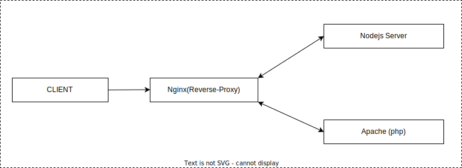

## [ Setup Node.js, Apache and an nginx reverse-proxy with Docker ] :

### 1. Download And Install Docker:

- For windows
  - [ Docker for Windows ](https://docs.docker.com/docker-for-windows/install/)
- For Linux
  - [ Docker for Linux ](https://docs.docker.com/engine/install/ubuntu/)

### 2. Clone the repository:

```bash
git clone https://github.com/Ashkumar7/Node-Php-Apache-Nginx-In-Docker.git
```

### 3. and run the container:

```bash
docker compose up -d
```

## [ But hold on, how this works? ] :

- Take how internal network looks like after running the containers:



- Now, let's understand how this works:

  - When we hit the url `http://localhost:8000` in our browser, the request goes to the nginx container. Nginx is configured to reverse-proxy the request to the apache container and node container. Nginx container is configured to listen on port 80, take a look at the docker-compose.yml file. you will see the following configuration:
    ```yaml
    nginx:
      ports:
        - '8000:80' # "host_port:container_port"
    ```
  - Now, every file inside `api` folder is served by the apache container. take a look at the `default.conf` file inside root folder. any client request to `/api` will be reverse-proxied to the apache container. therefore those are available for node container. you will see the following configuration:
    ```conf
    location /api {
        rewrite ^([^.\?]*[^/])$ $1/ break;
        proxy_pass http://php:80;
    }
    ```

- Now, we can test this inside our nodejs backend.

  ```js
  const php_backend_url = 'http://php:80';

  try {
    const req = await fetch(`${php_backend_url}/api/get_my_ip.php`);
    const res = await req.json();
    console.log(res);
  } catch (error) {
    console.log(error);
  }
  ```

## [ Now Lets Understand docker-compose.yml file ]:

```yaml
version: '3.9'

services:
  nginx:
    container_name: reverse_proxy
    image: nginx:alpine
    ports:
      - '8000:80'
    volumes:
      - ./php/:/var/www/html
      - ./default.conf:/etc/nginx/conf.d/default.conf
    depends_on:
      - php
      - node

  php:
    container_name: php
    image: php:8.0-apache
    volumes:
      - ./php/:/var/www/html

  node:
    image: node:18.10-slim
    environment:
      - NODE_ENV=production
    working_dir: /app
    volumes:
      - ./node/:/app
    depends_on:
      - php
    command: >
      sh -c '
        if [ -z "$(which yarn)" ]; then
          echo "Yarn not found, installing...";
          npm install -g yarn;
        else
          echo "Yarn is already installed";
        fi &&
        if [ -z "$(which typescript)" ]; then
          echo "Typescript not found, installing...";
          npm install -g typescript;
        else
          echo "Typescript is already installed";
        fi &&
        yarn install &&
        npx prisma generate &&
        yarn start
      '
```

- in our `docker-compose.yaml` file there are 3 services - `nginx, php-apache, node`.

  - lets break down everything inside the `nginx` service:
    - we give container_name of any of our choice using `container_name` key
      ```yaml
      container_name: reverse_proxy
      ```
    - we pull a specific image `nginx:alpine` from docker-hub using `image` key
      ```yaml
      image: nginx:alpine
      ```
    - we define `host_port` and `container_port` using `ports` key. so if any request comes through `host_port` it will forwarded to `container_port` then nginx will handle the rest later on.
      ```yaml
      ports:
        - '8000:80' # "host_port:container_port"
      ```
    - then we have `volumes` which will mirror the directory content to the container directory
      ```yaml
      volumes:
        - ./php/:/var/www/html
        - ./default.conf:/etc/nginx/conf.d/default.conf
      ```
    - `depends_on` key is to tell Docker Compose will start the `php` and `node` services before starting the service with the depends_on directive.
    ```yaml
    depends_on:
      - php
      - node
    ```
  - lets break down everything inside the `php` service:
    - we give container_name of any of our choice using `container_name` key
      ```yaml
      container_name: php
      ```
    - we pull a specific image `php:8.0-apache` from docker-hub using `image` key
      ```yaml
      image: php:8.0-apache
      ```
    - then we have `volumes` which will mirror the directory content to the container directory
      ```yaml
      volumes:
        - ./php/:/var/www/html
      ```
  - lets break down everything inside the `node` service:
    - we give container_name of any of our choice using `container_name` key
      ```yaml
      container_name: node
      ```
    - we can set environment variable using `environments` key
      ```yaml
      environments:
        - NODE_ENV=production
      ```
    - The `working_dir` key in Docker Compose is used to set the working directory inside the container for a specific service. The working directory is the location in the container where commands are executed.
      ```yaml
      working_dir: /app
      ```
    - we pull a specific image `node:18.10-slim` from docker-hub using `image` key
      ```yaml
      image: node:18.10-slim
      ```
    - then we have `volumes` which will mirror the directory content to the container directory
      ```yaml
      volumes:
        - ./node/:/app
      ```
    - `depends_on` key is to tell Docker Compose will start the `php` service before starting the service with the depends_on directive.
      ```yaml
      depends_on:
        - php
      ```
    - `command` key is use to execute command, in our case install dependencies and run the app.
      ```yaml
      command: >
        sh -c '
          if [ -z "$(which yarn)" ]; then
          echo "Yarn not found, installing...";
          npm install -g yarn;
          else
          echo "Yarn is already installed";
          fi &&
          if [ -z "$(which typescript)" ]; then
          echo "Typescript not found, installing...";
          npm install -g typescript;
          else
          echo "Typescript is already installed";
          fi &&
          yarn install &&
          npx prisma generate &&
          yarn start
        '
      ```

## Credits

- [Raizel#Kreideprinz](https://github.com/Ashkumar7): It`s me ofcourse!

Feel free to customize based on your specific needs and the nature of your app.
